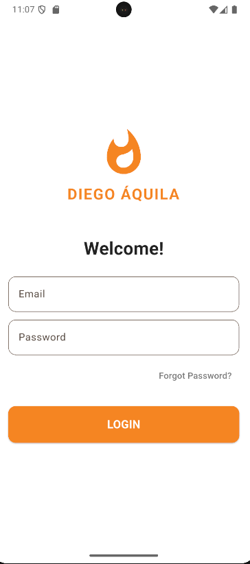
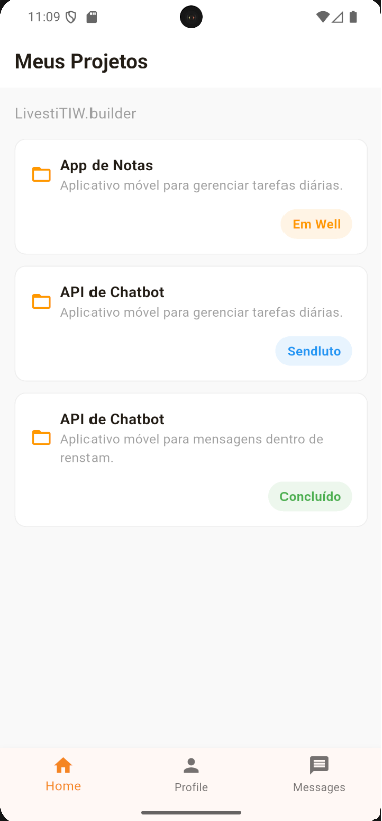
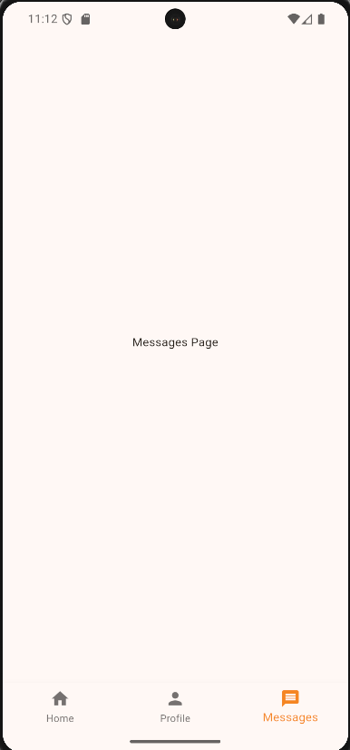
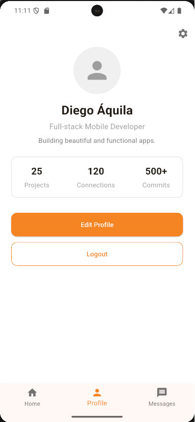

# 📱 Projeto de Portfólio em Flutter

Este é um projeto de aplicativo móvel desenvolvido em Flutter, criado com base em um design UI/UX moderno. O aplicativo serve como um portfólio para desenvolvedores, exibindo projetos, informações de perfil e estatísticas de desenvolvimento.

## ✨ Telas Principais

| Tela de Login | Projetos (Home) | Mensagens | Perfil |
| :---: |:---:|:---:|:---:|
|  |  |  |  |
## 🚀 Funcionalidades

  - **Tela de Autenticação:** Interface de login limpa e intuitiva.
  - **Visualização de Perfil:** Exibe informações do usuário, como nome, cargo, biografia e um avatar.
  - **Estatísticas do Desenvolvedor:** Um card que mostra métricas como número de projetos, conexões e commits.
  - **Listagem de Projetos:** Uma tela dedicada para listar os projetos do usuário, com título, descrição e status (Ex: Concluído, Em andamento).
  - **Navegação Simples:** Uso de `BottomNavigationBar` para alternar facilmente entre as telas principais do aplicativo.
  - **Interface Moderna:** Componentes de UI estilizados para corresponder a um design profissional e coeso.

## 🛠️ Tecnologias Utilizadas

  - **[Flutter](https://flutter.dev/):** Framework principal para o desenvolvimento da UI.
  - **[Dart](https://dart.dev/):** Linguagem de programação utilizada pelo Flutter.
  - **[Material Design](https://material.io/):** Componentes e diretrizes de design para uma experiência de usuário consistente.

## ▶️ Como Executar o Projeto

Siga os passos abaixo para executar o projeto em sua máquina local.

**Pré-requisitos:**

  - Ter o [Git](https://git-scm.com/) instalado.
  - Ter o [SDK do Flutter](https://flutter.dev/docs/get-started/install) configurado em sua máquina.

**Passo a passo:**

1.  **Clone o repositório:**

    ```sh
    git clone https://github.com/seu-usuario/nome-do-repositorio.git
    ```

2.  **Navegue até o diretório do projeto:**

    ```sh
    cd nome-do-repositorio
    ```

3.  **Instale as dependências:**

    ```sh
    flutter pub get
    ```

4.  **Execute o aplicativo:**

    ```sh
    flutter run
    ```

    O aplicativo deverá ser compilado e executado em seu emulador ou dispositivo físico conectado.

## 📂 Estrutura de Arquivos

A estrutura de arquivos principal foi organizada para separar as responsabilidades de cada tela, facilitando a manutenção e escalabilidade do projeto.

```
lib/
├── main.dart             # Ponto de entrada da aplicação e configuração do tema
├── login_page.dart       # Widget da tela de login
├── main_screen.dart      # Widget que gerencia a navegação principal (BottomNavigationBar)
├── profile_page.dart     # Widget da tela de perfil do usuário
└── projects_page.dart    # Widget da tela de listagem de projetos
```

## 📝 Próximos Passos (To-Do)

  - [ ] Conectar a um backend (Firebase, Supabase, etc.) para autenticação e dados dinâmicos.
  - [ ] Implementar um gerenciador de estado (Provider, BLoC) para controlar o fluxo de dados.
  - [ ] Adicionar a funcionalidade de "Editar Perfil".
  - [ ] Criar testes unitários e de widgets.
  - [ ] Adicionar animações para melhorar a experiência do usuário.

## 📄 Licença

Este projeto está sob a licença MIT. Veja o arquivo `LICENSE` para mais detalhes.

-----

**Como usar:**

1.  Crie um arquivo chamado `README.md` no diretório principal do seu projeto.
2.  Copie e cole o texto acima nele.
3.  **Importante:** Altere a URL do repositório no comando `git clone` para o link do seu próprio repositório no GitHub.

Quando você enviar seu código para o GitHub (`git push`), este arquivo será renderizado lindamente na página inicial do seu repositório.

https://www.notion.so/diegoaquila/Constru-o-de-Telas-em-Flutter-2706823964e780a3bdc9cd301aaeda79