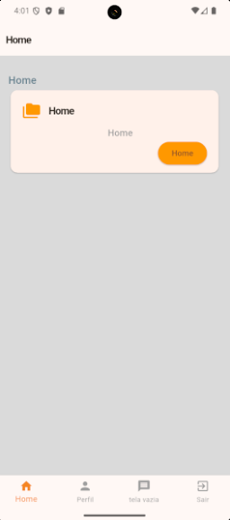

# 📱 Implementando Navegação entre Páginas no Flutter para a UC13 - Desenvolvimento Mobile

Instruções:
Implementar a navegação entre as 3 telas já desenvolvidas no app, permitindo que o usuário transite entre elas usando técnicas de navegação do Flutter.

Mais informações dio desafio no link:
https://www.notion.so/diegoaquila/Atividade-Implementando-Navega-o-entre-P-ginas-no-Flutter-2786823964e7805191b3de6bb45ec04b


## 📱 Projeto de Portfólio em Flutter

Este é um projeto de aplicativo móvel desenvolvido em Flutter que serve como um template inicial para um portfólio de desenvolvedor. Ele inclui uma estrutura de navegação básica com tela de login e páginas principais.

## ✨ Telas Principais

O aplicativo é composto pelas seguintes telas:

| Tela de Login | Projetos (Home) | Perfil | Menssagem | Sair
| :---: |:---:|:---:|:---:|:---:
|||| |

*Observação: As imagens acima são representações baseadas na estrutura do código. A tela de "Mensagens" é atualmente um placeholder.*

## 🚀 Funcionalidades

  - **Tela de Autenticação:** Uma página de login simples que redireciona para a tela principal do aplicativo.
  - **Navegação Principal:** Utiliza um `BottomNavigationBar` para alternar facilmente entre as seções: Home (Projetos), Perfil, uma tela vazia e Sair.
  - **Estrutura de Páginas:** Telas pré-definidas para "Projetos" e "Perfil", prontas para serem preenchidas com conteúdo dinâmico.
  - **Função de Saída:** Uma tela de "Sair" que permite ao usuário retornar à tela de login.
  - **Interface Coesa:** O design utiliza estilos e cores centralizados para manter a consistência visual em todo o aplicativo.

## 🛠️ Tecnologias Utilizadas

  - **[Flutter](https://flutter.dev/):** Framework principal para o desenvolvimento da UI multiplataforma.
  - **[Dart](https://dart.dev/):** Linguagem de programação utilizada pelo Flutter.
  - **[Material Design](https://material.io/):** Componentes e diretrizes de design para uma experiência de usuário consistente.

## 📂 Estrutura de Arquivos

A estrutura de arquivos foi organizada para separar a lógica das telas e as configurações de UI, facilitando a manutenção.

```
lib/
├── app.dart                  # Widget principal (MaterialApp) e configuração do tema
├── main.dart                 # Ponto de entrada da aplicação
│
└── pages/
    ├── login_page.dart         # Tela de login
    │
    ├── config/
    │   ├── main_screen.dart    # Gerencia a navegação principal (BottomNavigationBar)
    │   ├── app_colors.dart     # Definições de cores globais
    │   └── app_text_style.dart # Definições de estilos de texto globais
    │
    ├── projects_page.dart      # Tela que exibe os projetos
    ├── profile_page.dart       # Tela do perfil do usuário
    └── exit_page.dart          # Tela com a função de sair
```

## 📂 **[Desenvolvimento](/changelog.md)** 

Abaixo está a explicação detalhada de como o `main_screen.dart` funciona e como ele se integra com as outras telas do seu aplicativo, seguindo a estrutura de arquivos fornecida.

### Entendendo o `main_screen.dart`: O Gerenciador de Navegação

O arquivo `main_screen.dart` é o coração da navegação do seu aplicativo após o login. Ele não é uma tela com conteúdo próprio, mas sim um "contêiner" que gerencia e exibe outras telas com base na interação do usuário com a barra de navegação inferior (`BottomNavigationBar`).

Veja como ele funciona, passo a passo:

1.  **StatefulWidget**: A classe `MainScreen` é um `StatefulWidget`. Isso é essencial porque o conteúdo da tela precisa mudar sempre que o usuário toca em um ícone diferente na barra de navegação. Um `StatefulWidget` pode ter seu estado interno alterado, o que faz com que a interface do usuário seja redesenhada.

2.  **`_selectedIndex`**: Esta é a variável de estado. É um número inteiro que armazena o "índice" da aba atualmente selecionada.

      * `0` corresponde a 'Home' (ProjectsPage)
      * `1` corresponde a 'Perfil' (ProfilePage)
      * `2` corresponde a 'tela vazia'
      * `3` corresponde a 'Sair' (ExitPage)

3.  **`_widgetOptions`**: Esta é uma lista de `Widgets` (as suas telas). A ordem dos widgets nesta lista é crucial, pois corresponde diretamente aos índices do `_selectedIndex`.

    ```dart
    static const List<Widget> _widgetOptions = <Widget>[
      ProjectsPage(),    // Índice 0
      ProfilePage(),     // Índice 1
      Text('tela vazia'),// Índice 2
      ExitPage(),        // Índice 3
    ];
    ```

4.  **`_onItemTapped(int index)`**: Esta função é o cérebro da navegação.

      * Ela é chamada toda vez que o usuário toca em um item da `BottomNavigationBar`.
      * Ela recebe o `index` do item que foi tocado.
      * Dentro dela, `setState(() { _selectedIndex = index; });` atualiza a variável de estado. Chamar `setState` notifica o Flutter que o estado mudou, e o framework automaticamente reconstrói a interface para refletir essa mudança.

5.  **`build(BuildContext context)`**: Este método constrói a interface visual.

      * **`body`**: O corpo do `Scaffold` é definido como `_widgetOptions.elementAt(_selectedIndex)`. Isso significa que ele pega a tela correspondente ao índice selecionado na lista `_widgetOptions` e a exibe. Se `_selectedIndex` for `1`, ele exibirá a `ProfilePage()`.
      * **`bottomNavigationBar`**: Aqui é onde a barra de navegação é criada.
          * **`items`**: Define os botões/ícones que aparecerão na barra.
          * **`currentIndex`**: Informa à barra qual item deve ser destacado como "ativo". Ele está diretamente ligado à variável `_selectedIndex`.
          * **`onTap`**: Este é o gatilho. Ele especifica que a função `_onItemTapped` deve ser executada quando um item for tocado.

### Como a Navegação Funciona no Projeto Inteiro (Implementação por Arquivo)

Agora, vamos ver como a navegação flui desde o início do aplicativo até a tela de saída, com base na sua estrutura de arquivos.

#### 1\. `main.dart` (Ponto de Entrada)

Este é o primeiro arquivo a ser executado. Sua única responsabilidade é iniciar o aplicativo chamando o widget `MyApp`.

```dart
// lib/main.dart
import 'package:flutter/material.dart';
import 'package:flutter_application_diego_aquila/app.dart';

void main() {
  runApp(const MyApp());
}
```

#### 2\. `app.dart` (Configuração Principal)

Este arquivo configura o `MaterialApp`, que é o widget raiz do aplicativo. Ele define o tema, remove o banner de debug e, o mais importante, define a `home` como `LoginPage()`. Isso garante que a primeira tela que o usuário vê é a de login.

```dart
// lib/app.dart
import 'package:flutter/material.dart';
import 'package:flutter_application_diego_aquila/pages/login_page.dart';

class MyApp extends StatelessWidget {
  const MyApp({super.key});

  @override
  Widget build(BuildContext context) {
    return MaterialApp(
      title: 'Diego Áquila App',
      debugShowCheckedModeBanner: false,
      theme: ThemeData(...),
      home: const LoginPage(), // Inicia o app na tela de login
    );
  }
}
```

#### 3\. `login_page.dart` (Navegando para a Tela Principal)

Aqui, o usuário interage com o botão "Acessar". A mágica acontece no `onPressed`:

```dart
// lib/pages/login_page.dart
onPressed: () {
  // Navega para a tela principal e REMOVE a tela de login da pilha
  Navigator.of(context).pushReplacement(
    MaterialPageRoute(builder: (context) => const MainScreen()),
  );
},
```

  * **`Navigator.of(context).pushReplacement(...)`**: Este comando navega para a `MainScreen`. A parte crucial é o `pushReplacement`. Ele substitui a tela de login pela `MainScreen` na "pilha" de navegação. Isso impede que o usuário pressione o botão "Voltar" do dispositivo e retorne para a tela de login.

#### 4\. `main_screen.dart` (Gerenciando as Telas Internas)

Como explicado anteriormente, uma vez que o usuário está na `MainScreen`, este widget assume o controle. Ele exibe a `ProjectsPage` por padrão (`_selectedIndex` começa em `0`) e permite que o usuário alterne entre as telas definidas em `_widgetOptions` usando a barra de navegação.

#### 5\. `projects_page.dart` e `profile_page.dart` (Telas de Conteúdo)

Esses são widgets `StatelessWidget` simples que apenas exibem o conteúdo estático de cada tela. Eles são as telas que o usuário vê dentro do "contêiner" da `MainScreen`.

#### 6\. `exit_page.dart` (Saindo do Aplicativo)

A tela de saída funciona de forma muito semelhante à tela de login, mas no sentido inverso. O botão "Sair" também usa `pushReplacement` para voltar à tela de login.

```dart
// lib/pages/exit_page.dart
onPressed: () {
  // Navega para a tela de login e REMOVE a tela principal da pilha
  Navigator.of(context).pushReplacement(
    MaterialPageRoute(builder: (context) => const LoginPage()),
  );
},
```

Isso efetivamente "reseta" o fluxo do aplicativo, levando o usuário de volta ao início como se ele tivesse acabado de abrir o app, sem a possibilidade de voltar para a `MainScreen`.